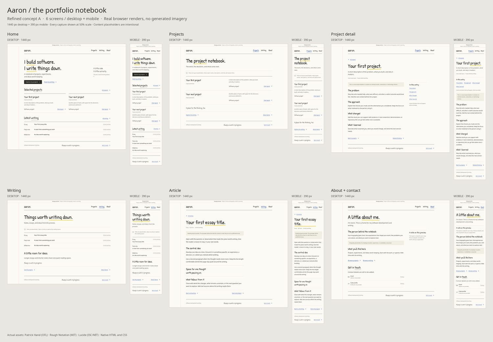

# Portfolio notebook rebuild plan

Specification P2 · 30 September 2026 · Planning material for [Aa-thomas/portfolio](https://github.com/Aa-thomas/portfolio).

- [Specification](spec.md): agreed features, proposed policies, and open decisions.
- [Published issues and dependencies](tracking.md): [parent #7](https://github.com/Aa-thomas/portfolio/issues/7) with ten proposed child issues.
- [Ticket breakdown](tickets.md): ten vertical implementation slices and their dependencies.
- [Wireframes](wireframes.md): six existing public screens on desktop and mobile; missing publishing screens are PF-01.
- [Contact sheet](wireframes/contact-sheet.png) and [screen gallery](wireframes/contact-sheet.html).
- [Event Model source](publishing.em), [diagram](publishing.svg), and [24 acceptance scenarios](scenarios.md).
- [Verification](verification.md): observed planning/model/preview checks and their limits.

Prepared with to-spec and to-tickets. The user authorized publication of this specification, wireframes, and ticket breakdown. Application implementation remains stopped until separately authorized. Detailed hosting, login, media, Markdown, and publishing-policy choices remain proposed; issue creation does not make them ready for implementation.

The repository currently contains a static HTML/CSS/JavaScript portfolio. These documents describe its proposed SvelteKit/TypeScript successor. Existing application files are unchanged by this documentation publication. No root package, dependency installation, or deployment configuration is introduced.

The wireframes preserve the existing Impeccable-refined design, using real open-source assets and deliberately labeled placeholders. The contact sheet contains twelve browser captures. It does not yet include the private publishing dashboard or photo-card controls introduced in the later requirements; PF-01 covers those designs.
