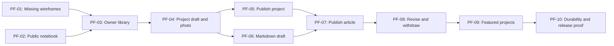

# Portfolio notebook: implementation ticket proposal

Revision P2 · GitHub publication plan for Aa-thomas/portfolio

Source: [specification P2](spec.md), [wireframes](wireframes.md), [proposed model](publishing.em), [rendered diagram](publishing.svg), and [scenarios SC-01–SC-24](scenarios.md). All tickets are **proposed**. Document completion does not authorize implementation. GitHub issue publication is authorized in Aa-thomas/portfolio. The local PF identifiers remain stable planning references; actual GitHub numbers are recorded in the published parent issue.

**Common gates:** D-01 is resolved to Aa-thomas/portfolio and GitHub issues; G-01 requires explicit permission to begin application work; G-02 requires explicit deployment authority. D-07 blocks release with real portfolio content, not a local demonstration using clearly marked fixtures. The package is published through a documentation branch/PR. Published issues link accessible commit-pinned model, scenario, specification, and wireframe artifacts. Check duplicates and create native dependency links using actual issue IDs. Preserve these local PF references as traceability labels.

## Numbered proposal

| # / ID | Title and end-to-end result | Ticket blockers | Decision blockers | Status |
| --- | --- | --- | --- | --- |
| 1 / PF-01 | Complete publishing and photo-card wireframes: review every new screen/state alongside the existing public design. | None | D-02; review variants for D-03–06 | Proposed design work |
| 2 / PF-02 | Browse the responsive public notebook: navigate the six public routes with truthful empty states. | None | G-01 | Proposed |
| 3 / PF-03 | Sign in to a private content library and sign out: private reads/writes reject visitors. | PF-01, PF-02 | D-03, G-01 | Proposed |
| 4 / PF-04 | Save and reopen a project with a real thumbnail: details, photo, crop, and private preview persist. | PF-03 | D-04, D-06 | Proposed |
| 5 / PF-05 | Publish a project from its saved preview: it appears on public Home, index, and detail pages. | PF-04 | D-06 | Proposed |
| 6 / PF-06 | Import and preview a Markdown article: source, metadata, formatting, and optional cover save privately. | PF-04 | D-05, D-06 | Proposed |
| 7 / PF-07 | Publish an article: the saved preview becomes a readable public page and index entry. | PF-05, PF-06 | D-05, D-06 | Proposed |
| 8 / PF-08 | Revise, republish, and unpublish saved entries: drafts and live content remain distinct. | PF-07 | D-06 | Proposed |
| 9 / PF-09 | Select and order featured projects: Home reflects owner choices and publication eligibility. | PF-08 | D-06 | Proposed |
| 10 / PF-10 | Prove durability and release readiness on the selected host: text/media survive restart and restore. | PF-09 | D-03, D-07, G-02 for host changes | Proposed |

The Markdown ticket depends on PF-04 for the shared owner-only media/storage boundary used by optional covers and any agreed owned-image mapping. PF-07 depends on PF-05 for the shared publication operation. PF-09 depends on PF-08 because its acceptance includes removal of an unpublished featured project. Dependencies are completion requirements for whole demonstrable tickets, not restrictions on independent planning or read-only design work.

## Shared verification contract

Each application ticket must deliver its own observable path, including relevant errors, keyboard/mobile behavior, and server-side permission checks. It must not leave a disconnected UI or pretend success response. Run the chosen project's type/Svelte checks and focused scenario tests; record results rather than assuming earlier tickets passed.

All workflow tickets **reuse** [publishing.em](publishing.em) and the stable scenario IDs. If implementation reveals a contract change, resolve the relevant decision and update the shared source, scenarios, and affected tickets together, then validate/render and inspect the model using the eventual repository-pinned tool. Do not make a second competing model. [Current verification](verification.md) concerns planning artifacts only; application tests below have not run.

## PF-01 — Complete publishing and photo-card wireframes

**Expected result and acceptance:** a connected, reviewable design supplement shows owner sign-in; empty/populated library; project create/edit with URL, title, description, photo, crop, alt text, and card preview; Markdown import with metadata/source/preview and optional cover; publish/republish; unpublish; and featured ordering. Show desktop and mobile, processing/saving, validation failure, expired session, duplicate slug, stale edit, and failed-save states. Update Home and Projects with photo and no-photo variants while keeping writing visible. Add all new captures to a contact sheet. Do not claim that the six existing wireframes already cover these surfaces.

**Reuse:** verified [six public HTML templates and assets](wireframes/README.md), [current contact sheet](wireframes/contact-sheet.html), and the inspected palette/type/spacing in the copied stylesheet. New: private screens and image-card variants. Use labeled upload areas until Aaron supplies an actual photo; no stock/generated portfolio imagery or new fictional claims.

**Interfaces and invariants:** the design must distinguish unsaved edits, saved draft, live revision, and pending failure. Primary controls have clear labels; crop/reorder controls need keyboard alternatives. Represent D-03–06 as variants or visible unresolved notes until reviewed. Owners: INV-01/02/04/06.

**Failure cases and verification:** compare to [SC-01](scenarios.md#sc-01), [SC-03](scenarios.md#sc-03), [SC-07](scenarios.md#sc-07), [SC-13](scenarios.md#sc-13), [SC-17](scenarios.md#sc-17), and [SC-21](scenarios.md#sc-21). Inspect actual browser captures at the agreed widths, links, focus, labels, overflow, and contrast. Model action: reuse; update only if reviewed screen decisions change behavior. No application implementation is part of this design ticket.

**Dependencies and open decisions:** no ticket blockers. D-02 is resolved by review of this supplement; D-03–06 remain explicit where they affect the screen contract. Existing public screenshots stay preserved as the prior reference. Status: proposed design work.

## PF-02 — Browse the responsive public notebook

**Expected result and acceptance:** in the eventually authorized SvelteKit/TypeScript project, a visitor can navigate Home, Projects, Writing, About/contact, and known project/article detail templates. With no published content, indexes and Home show intentional empty states; nonexistent detail URLs return a real not-found response. Use explicitly marked local fixtures only when demonstrating populated templates. The home hierarchy follows the selected portfolio-first design. About/contact shows only supplied values; absent links are not clickable inventions.

**Reuse:** verified [Home](wireframes/index.html), [Projects](wireframes/projects.html), [project detail](wireframes/project.html), [Writing](wireframes/writing.html), [article](wireframes/article.html), [About](wireframes/about.html), CSS tokens, Rough Notation/Lucide/Patrick Hand and licenses. New: Svelte layout/route components and a narrow published-content read boundary initially returning empty results. The current static site is legacy reference, not a SvelteKit implementation or content backend. Keep existing root application files intact during planning publication.

**Interfaces and invariants:** server-rendered reading uses the proposed public URL contract; presentation receives published view data, not owner records. Body text stays readable. No per-user server-global state. Annotations cannot prevent navigation or reading if unavailable. Owners: INV-02/04/06.

**Failure cases and verification:** [SC-20](scenarios.md#sc-20), [SC-21](scenarios.md#sc-21), [SC-22](scenarios.md#sc-22): empty collections, missing pages, long titles, absent contact targets, keyboard navigation, responsive layouts, reduced motion. Check type/Svelte/build commands selected for the actual repository. Reuse model public-read contract; no new behavior model is needed for transcribing existing visual layouts. Existing screenshot checks are historical reference, not proof of this implementation.

**Dependencies and open decisions:** no ticket blockers. D-01 is resolved; G-01 still blocks application work. Real content D-07 blocks release only. Later content tickets replace the empty read boundary with durable published queries; no fake CMS data belongs in production. Status: proposed.

## PF-03 — Sign in to a private content library and sign out

**Expected result and acceptance:** a deliberately provisioned owner can sign in, see an empty or populated library split by draft/live state, and sign out. Visitors and expired sessions cannot read owner data or invoke mutations. There is no public registration. The selected owner recovery procedure is recorded and demonstrable in a test environment.

**Reuse:** PF-02 application and layout; PF-01 reviewed login/library states. New: selected open-source authentication integration, owner-access boundary, durable content store and private library read. SQLite/Better Auth/Node are unaccepted candidates, not reuse requirements.

**Interfaces and invariants:** derive the owner from the server session. Apply access checks to loaders, actions/endpoints, previews, and later media operations. Use secure session handling appropriate to the selected provider, same-origin mutation protection, and private cache policy. Credentials/tokens never become content events, page data, or logs. Owner: INV-01/02.

**Failure cases and verification:** [SC-01](scenarios.md#sc-01) and [SC-02](scenarios.md#sc-02): successful login/logout, invalid login, expired cookie, direct unauthorized reads/writes, cross-origin submission, and another tab after logout. Use browser plus server-request checks; demonstrate actual server rejection, not only hidden buttons. Model: reuse Open/Read/Close owner-session slices; resolve D-03 marker before readiness and revalidate/render.

**Dependencies and open decisions:** PF-01 and PF-02. D-03 must settle host/runtime compatibility, authentication, provisioning/recovery, and durable storage; G-01 applies. Status: proposed.

## PF-04 — Save and reopen a project with a real thumbnail

**Expected result and acceptance:** the owner enters project URL/title/description, uploads an optional real photo under the reviewed policy, adjusts framing, previews the card, saves a draft, and reopens the same content and crop. Saving incomplete text is permitted while publish-required omissions remain visible. Photos are decoded/validated, oriented, resized, and consistently framed; text-only fallback remains attractive. Nothing is public yet.

**Reuse:** PF-03 session/store/library and PF-01 project editor; verified public project-card design as extended by PF-01. New: project save operation and shared private media boundary. Sharp is the accepted processing direction; an accessible crop control may use an established open-source component or ordinary controls, chosen and verified during implementation.

**Interfaces and invariants:** ProjectFields, stable entry identity, request identity, expected draft version, source photo, derived thumbnails, crop, and alt text. Publish and photo limits are enforced on the server. Validate HTTP(S) without fetching the website. A failed replacement preserves previous saved data/media; all draft media stays private. Owners: INV-01/02/03/04/05.

**Failure cases and verification:** [SC-03](scenarios.md#sc-03), [SC-04](scenarios.md#sc-04), [SC-05](scenarios.md#sc-05), [SC-16](scenarios.md#sc-16), [SC-17](scenarios.md#sc-17), [SC-24](scenarios.md#sc-24), plus SC-02/21. Cover corrupt/oversized/mislabeled files, unsupported animation/SVG if the proposed policy is adopted, small source images, processor/storage failure, unauthorized asset URLs, duplicate retry, and stale save. Verify a reopened saved record and real derivative dimensions/crop. Model: reuse Save project draft/Preview project; update D-04/D-06 after review.

**Dependencies and open decisions:** PF-03. D-04 defines required/optional fields, photo policy, limits, crop ratio, and alt text; D-06 defines save/retry/version semantics. Status: proposed.

## PF-05 — Publish a project from its saved preview

**Expected result and acceptance:** preview a complete saved project, publish, then open a signed-out browser to see it on Projects and its detail page, with Home following the reviewed fallback rule. Supplied title, description, website URL, photo, and crop match preview. Quick-add projects do not require a full case study or show invented narrative. Page title/description use the published values. No manual rebuild is required.

**Reuse:** PF-04 project/media operation, PF-03 durable store/access, PF-02 public components. New: shared publication operation, unique slug check, published snapshot/read queries, and authorized public-media reads. Article publication later uses the same lifecycle boundary.

**Interfaces and invariants:** publish by entry ID, expected saved version, chosen slug, and request identity. Public DTOs omit drafts/owner data; first-publication time is server-owned. A response indicating success follows durable publication. Owners: INV-02/03/05/06.

**Failure cases and verification:** [SC-06](scenarios.md#sc-06), [SC-16](scenarios.md#sc-16), [SC-18](scenarios.md#sc-18), [SC-20](scenarios.md#sc-20), [SC-22](scenarios.md#sc-22), [SC-24](scenarios.md#sc-24), plus SC-02/21. Duplicate slug, incomplete draft, unsafe URL, stale publish, missing derivative, and storage failure leave the previous public state unchanged. Model: reuse Publish entry/Read public entries; validate/render if approved lifecycle choices change it.

**Dependencies and open decisions:** PF-04. D-06 settles snapshot, URL, retry, and default ordering rules. D-07 affects release content only. Status: proposed.

## PF-06 — Import and preview a Markdown article

**Expected result and acceptance:** choose a `.md` file, inspect suggested title/excerpt/slug, edit metadata and source using the reviewed control, preview supported Markdown, optionally upload a cover, save privately, and reopen without losing source text. Display import/formatting/image warnings before publishing. Unknown metadata has no hidden effect.

**Reuse:** PF-03 owner library/storage; PF-04 private media, version/retry boundary, and optional cover workflow; PF-01 import screens; verified [article typography](wireframes/article.html). New: Markdown/frontmatter parser, draft save operation, and one sanitized renderer shared with future public pages. Use the accepted remark direction; the exact GFM/sanitizer configuration must match the reviewed contract.

**Interfaces and invariants:** preserve original source and explicit editable metadata; render Markdown as data, not Svelte/MDX. Do not let metadata assign owner or publication state. Use the agreed title precedence and image policy. Parser/rendering work is bounded by agreed input limits; draft previews/assets remain private. Owners: INV-01/02/03/04/06.

**Failure cases and verification:** [SC-07](scenarios.md#sc-07) through [SC-11](scenarios.md#sc-11), plus [SC-16](scenarios.md#sc-16), [SC-17](scenarios.md#sc-17), SC-02/21/24. Test no frontmatter, duplicate H1, invalid YAML/UTF-8, oversized content, unsafe links/HTML, missing images, long code/tables, failed storage, retry, and stale save. Observe correct preview and reopened source; assert unsafe content cannot execute. Model: reuse Import article draft/Preview article and Save revised draft for subsequent saves.

**Dependencies and open decisions:** PF-04 for shared private media/storage. D-05 fixes the Markdown contract and source-editing/image behavior; D-06 fixes save/retry/version rules. D-04 cover policy is inherited from PF-04. Status: proposed.

## PF-07 — Publish an article to the notebook

**Expected result and acceptance:** publish a complete saved article and view it signed out at its stable route, in Writing, and in latest writing on Home. Body formatting matches private preview; title is shown once, excerpt/cover are correct, and no draft or original-upload metadata leaks. Generated page title/description match the publication. Unknown/unpublished article URLs return not-found.

**Reuse:** PF-06 article draft/renderer, PF-05 shared publication and public-read boundaries, PF-02 writing/article/Home components. New: article-specific publication validation and reader view wiring. Do not introduce a second sanitizer or independent article publication state machine.

**Interfaces and invariants:** one saved revision is the preview/publish unit. Source Markdown remains durable, but the public view exposes only intended content. Unique writing slugs and original publication date follow the shared rules. Owners: INV-02/03/04/05/06.

**Failure cases and verification:** [SC-10](scenarios.md#sc-10), [SC-12](scenarios.md#sc-12), [SC-16](scenarios.md#sc-16), [SC-18](scenarios.md#sc-18), SC-20/21/22/24. Reject incomplete metadata, unresolved images under the adopted policy, duplicate slug, and stale version without changing public data. Compare preview/public rendering of the same fixture; inspect signed-out HTML/data and narrow-screen code/table behavior. Model: reuse Publish entry/Read public entries; no separate article-only lifecycle model.

**Dependencies and open decisions:** PF-05 and PF-06. D-05/D-06 rules must be reviewed; D-07 blocks real-content release. Status: proposed.

## PF-08 — Revise, republish, and unpublish saved entries

**Expected result and acceptance:** edit either published kind, save privately, and verify the old live version remains. Republish to replace the complete public snapshot. Unpublish to remove it from Home/index/detail while keeping its draft in the owner library. The library clearly marks saved draft changes versus live content. No permanent delete action is introduced.

**Reuse:** PF-04 project editor/media; PF-06 article editor/renderer; PF-05/PF-07 publication/read boundaries; PF-03 access/store. New: shared revision replacement and withdrawal operations with reviewed conflict UI from PF-01.

**Interfaces and invariants:** maintain stable IDs/slugs and original publication time. Use expected versions for save, republish, and withdrawal. Published media continues to reference the live revision until a new one is published; replacement draft media remains private. Withdrawal clears any feature selection for that entry and applies the chosen origin/cache policy. Owners: INV-01/02/03/05.

**Failure cases and verification:** [SC-13](scenarios.md#sc-13) through [SC-18](scenarios.md#sc-18), [SC-24](scenarios.md#sc-24), plus SC-02/21. Use two tabs for stale writes/publishes; retry an uncertain publish; inject media/storage failure; request withdrawn pages/assets signed out. Test both project and article paths with and without a photo. Model: reuse Save revised draft, Republish entry, Withdraw entry, and repeated Public entries views. Update and revalidate/render only on reviewed rule changes.

**Dependencies and open decisions:** PF-07, which delivers both complete publication paths through its dependencies. D-06 must settle draft/live separation, slug immutability, conflict handling, feature removal, and cache expectations. Hosted cache proof is completed in PF-10. Status: proposed.

## PF-09 — Select and order featured projects

**Expected result and acceptance:** the owner selects published projects up to the reviewed limit, changes their order without requiring drag input, saves, and sees exactly that selection on Home. With no selection, use the agreed fallback. An unpublished project disappears from selection and Home; republishing does not restore its selection unless deliberately chosen again.

**Reuse:** PF-03 private library; PF-05 project public queries; PF-08 publication eligibility/withdrawal; PF-02 Home layout; PF-01 reviewed ordering controls. New: featured-selection operation and saved ordered IDs with a version.

**Interfaces and invariants:** only published project IDs, no article/draft IDs, no duplicates, agreed maximum, version-checked save, deterministic order. Public Home derives display data from published project snapshots, not copied owner-card values. Owners: INV-01/02/03/05/06.

**Failure cases and verification:** [SC-19](scenarios.md#sc-19), [SC-20](scenarios.md#sc-20), [SC-21](scenarios.md#sc-21), [SC-24](scenarios.md#sc-24). Reject invalid or stale selections, over-limit lists, and a project unpublished in another tab; preserve the prior successful order on failure. Observe keyboard reorder, refresh, and signed-out Home. Model: reuse Choose featured projects/Read selected home, including removal on withdrawal.

**Dependencies and open decisions:** PF-08. D-06 determines count, fallback, tie-break, and reselect policy. Status: proposed.

## PF-10 — Prove durability and release readiness on the selected host

**Expected result and acceptance:** on an explicitly authorized staging/hosting target, save a project and article with media, publish them, restart/redeploy, and demonstrate intact draft/live data. Restore an isolated backup containing text and media and show that their relationships and access checks still work. Verify withdrawal against the actual cache configuration. Review all public/private desktop/mobile screens against the completed wireframe set and replace release placeholders only with supplied content. Record evidence and remaining release blockers.

**Reuse:** complete feature paths from prior tickets, selected host/adapter/storage/auth decisions, shared scenarios and contact sheets. New: only the provider-specific configuration, backup/restore instructions, and missing operational checks required by the chosen host. This is not a license to replace architecture or add a generic infrastructure framework.

**Interfaces and invariants:** deploys cannot silently reset durable content or media. Configuration/credentials remain outside public data. Backups must account for the actual selected database and media store consistently. An isolated restore must not overwrite the live source. Owners: INV-01/02/06/07.

**Failure cases and verification:** [SC-23](scenarios.md#sc-23), [SC-24](scenarios.md#sc-24), [SC-15](scenarios.md#sc-15), SC-02/21/22, plus one complete project and article journey. Prove failure/recovery against the chosen storage; report missing permissions/provider services honestly. Record actual deployed revision/environment and exact observed results. Local tests alone cannot establish host durability. Reuse model; update only if hosting changes observable publication behavior.

**Dependencies and open decisions:** PF-09 and its predecessor paths. D-03 selects infrastructure/backup target; D-07 supplies final public content; G-02 authorizes host mutations and any deployment. Preparatory documentation/configuration can be reviewed after G-01, but no hosted success or production release is claimed without separate authority and evidence. Status: proposed.

## Readiness and publication checkpoint

The user authorized publishing these planning documents and issues to Aa-thomas/portfolio. Incorporate reviewed policy decisions into the specification/model/scenarios before promoting any implementation ticket. The instruction to stop building remains in force. Documentation commits and issue creation are authorized; application work, readiness promotion, merges, and deployment are not implied.
