# Wireframes included with specification P2

The six public screens below are the current Impeccable-refined, high-fidelity design reference. Each has a full-page desktop capture at 1440 px and a mobile capture at 390 px. These are browser renders of the existing design, recovered from the recorded HTML/CSS/JavaScript generation sources after the project mirror lost its files. The real assets and licenses were restored and the twelve screenshots recaptured with the original capture procedure. No new design or imagery was introduced.

Open the [interactive contact sheet](wireframes/contact-sheet.html), [full-resolution contact sheet](wireframes/contact-sheet.png), or [connected Home preview](wireframes/index.html). The contact sheet displays all twelve captures at one common scale without stretching or cropping.

## Design rules to preserve

- Portfolio-first order: introduction, selected projects, latest writing, contact.
- Warm paper `#fcfaf4`, dark ink `#292a24`, blue links `#284fa4`, yellow accents `#f1df85`, and the thin notebook margin.
- Patrick Hand for headings and short labels; system body text for reading and forms.
- Real Rough Notation underlines/highlights and Lucide icons; no invented image assets.
- Comfortable article width, semantic headings/links, visible focus, responsive layout, and reduced-motion support.
- Placeholder copy remains explicitly unprovided content. It is not a biography, publication history, or project claim.

## Screen and ticket map

| ID | Existing screen | Intended public route | Tickets | Later addition |
| --- | --- | --- | --- | --- |
| WF-01 | Home | `/` | PF-02, PF-05, PF-07, PF-09 | Photo/no-photo project variants; live selected/recent content. |
| WF-02 | Projects | `/projects` | PF-02, PF-04, PF-05 | Thumbnail variants and published/empty data states. |
| WF-03 | Project detail | `/projects/<slug>` | PF-02, PF-05, PF-08 | Real website link/photo and a basic-entry variant without case-study text. |
| WF-04 | Writing | `/writing` | PF-02, PF-07 | Published entries, excerpts/dates if approved, empty state. |
| WF-05 | Article | `/writing/<slug>` | PF-02, PF-06, PF-07, PF-08 | Real Markdown structures, optional cover, long code/table states. |
| WF-06 | About/contact | `/about` | PF-02, PF-10 | Supplied biography and contact destinations. |

## WF-01 — Home

[HTML reference](wireframes/index.html) · [Desktop full size](wireframes/screens/index-desktop.png) · [Mobile full size](wireframes/screens/index-mobile.png)

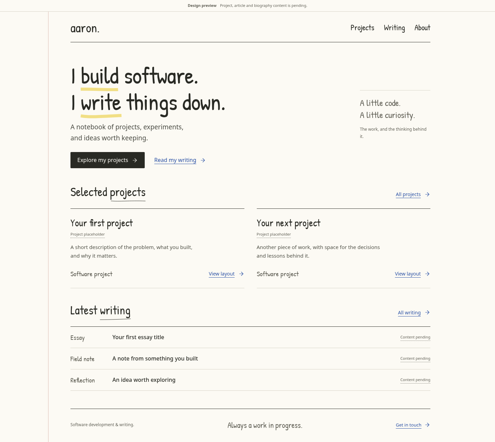

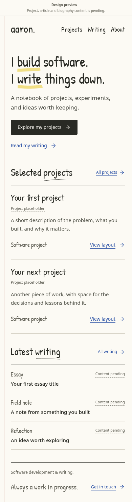

## WF-02 — Projects

[HTML reference](wireframes/projects.html) · [Desktop full size](wireframes/screens/projects-desktop.png) · [Mobile full size](wireframes/screens/projects-mobile.png)

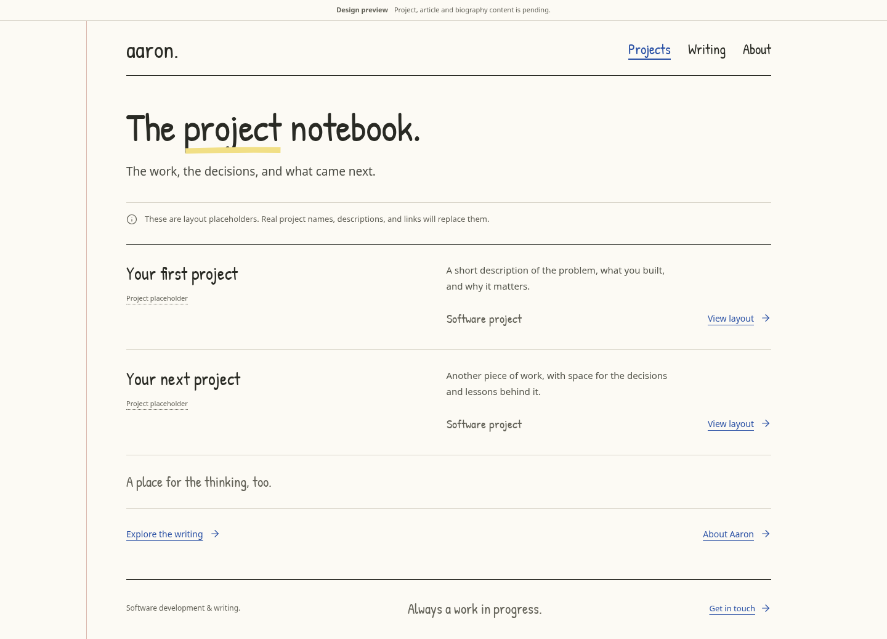

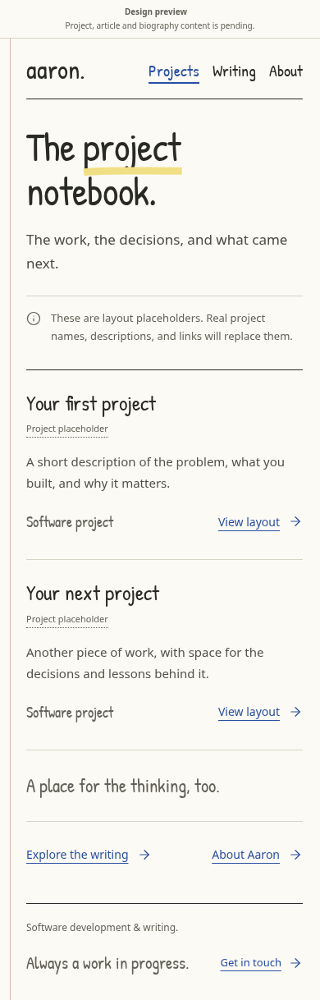

## WF-03 — Project detail

[HTML reference](wireframes/project.html) · [Desktop full size](wireframes/screens/project-desktop.png) · [Mobile full size](wireframes/screens/project-mobile.png)

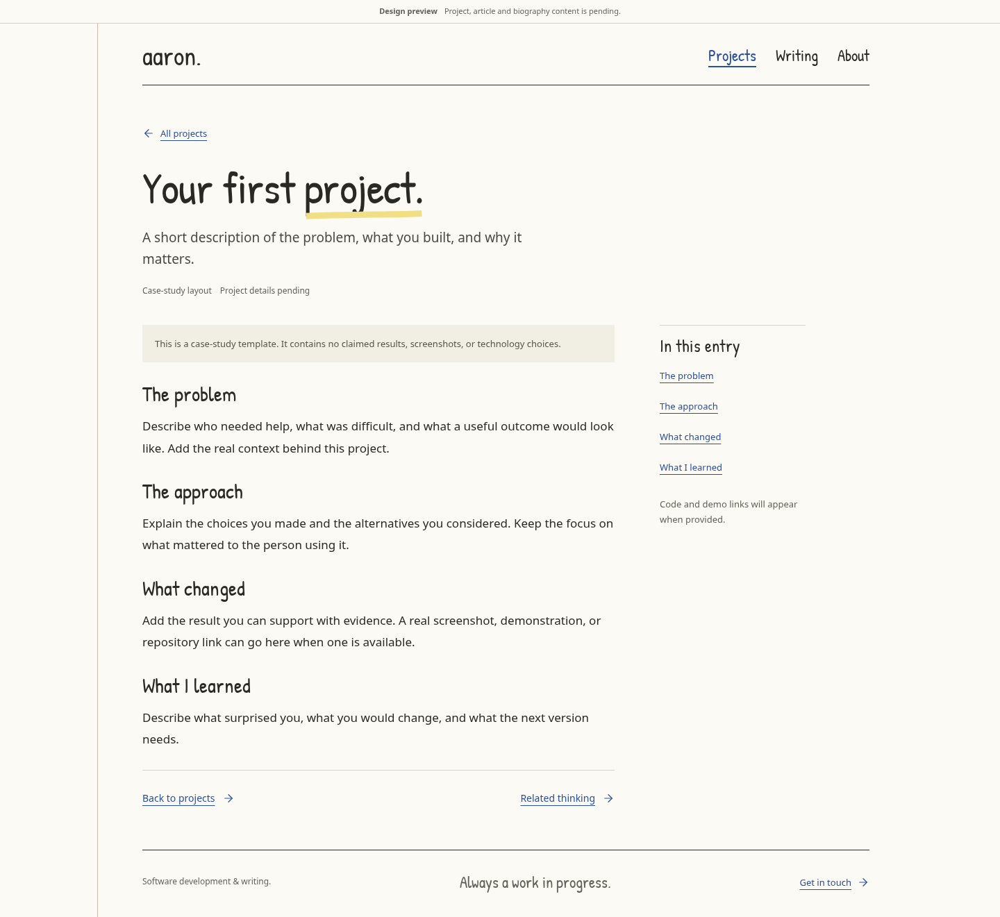

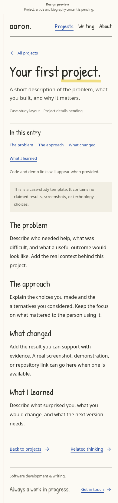

## WF-04 — Writing

[HTML reference](wireframes/writing.html) · [Desktop full size](wireframes/screens/writing-desktop.png) · [Mobile full size](wireframes/screens/writing-mobile.png)

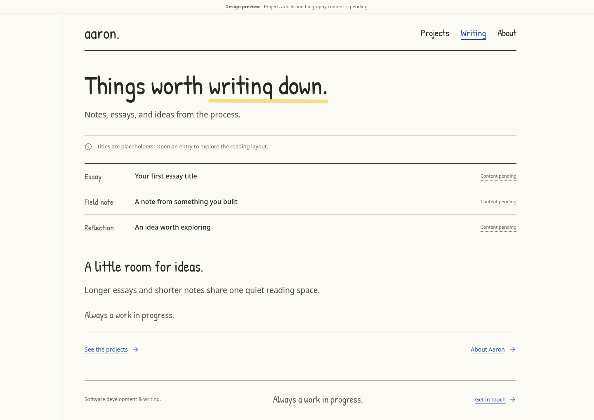

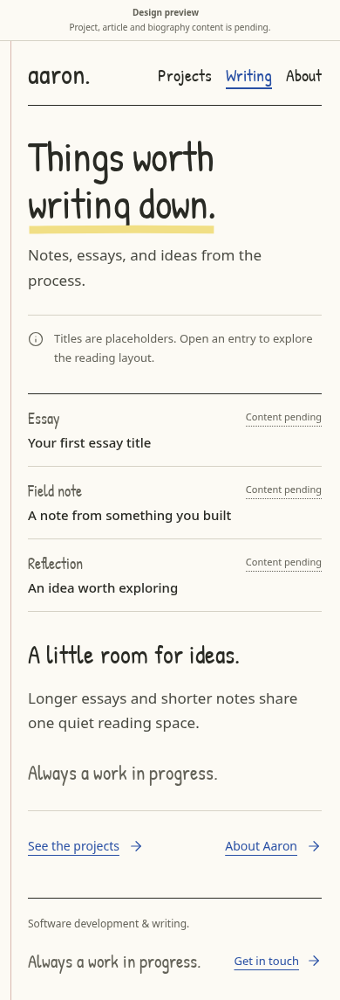

## WF-05 — Article

[HTML reference](wireframes/article.html) · [Desktop full size](wireframes/screens/article-desktop.png) · [Mobile full size](wireframes/screens/article-mobile.png)

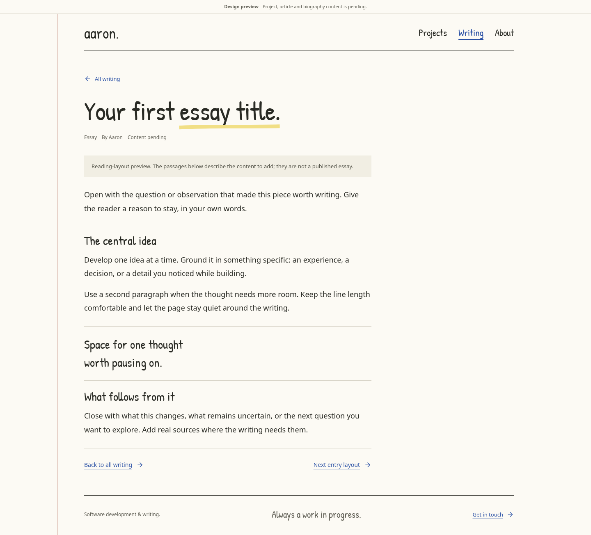

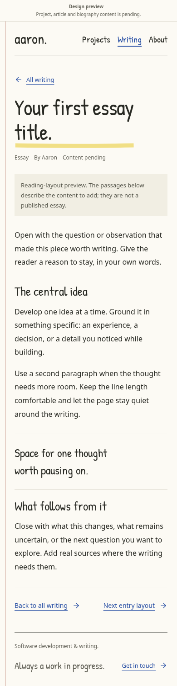

## WF-06 — About and contact

[HTML reference](wireframes/about.html) · [Desktop full size](wireframes/screens/about-desktop.png) · [Mobile full size](wireframes/screens/about-mobile.png)

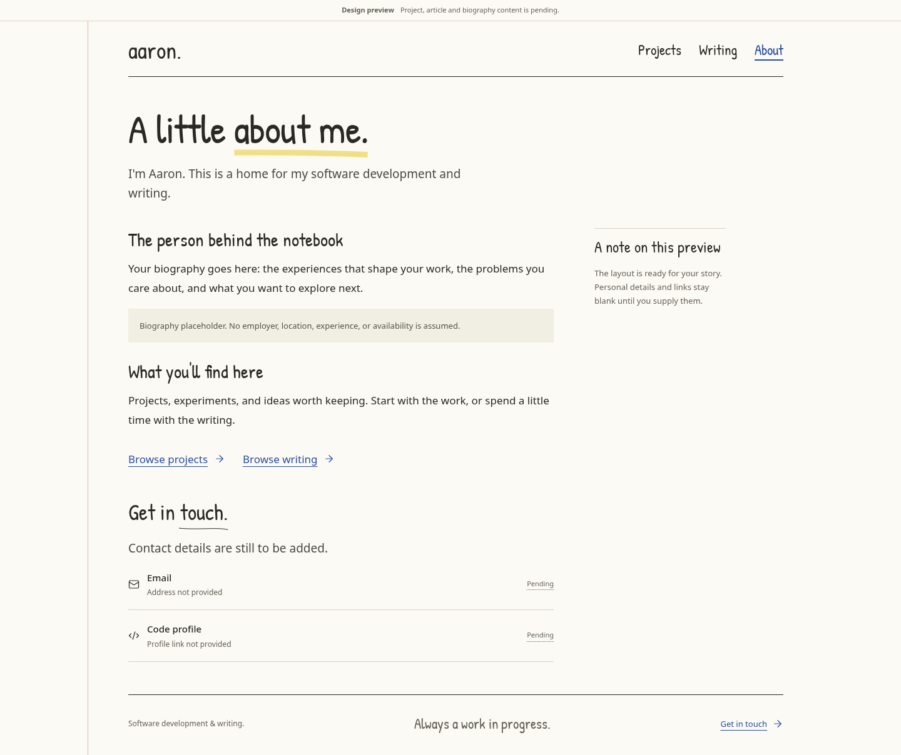

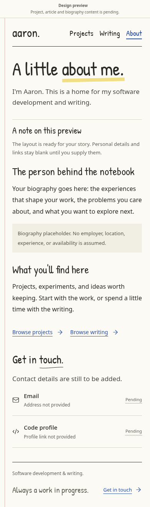

## Missing designs: PF-01 scope

These are **required design work**, not attached screenshots that already exist:

| Proposed design reference | Screen/states needed | Dependent tickets |
| --- | --- | --- |
| WF-07 | Owner sign-in, invalid sign-in, expired session, sign-out result. | PF-03 |
| WF-08 | Owner library: empty, populated, draft, published, published with draft changes, load failure. | PF-03, PF-08 |
| WF-09 | Project editor: URL/title/description, optional case-study text, photo selection, accessible crop, alt text, preview, failed upload/save. | PF-04, PF-08 |
| WF-10 | Article editor: `.md` selection, metadata/source controls, formatted preview, optional cover, import warnings and unresolved body images. | PF-06, PF-08 |
| WF-11 | Publish/republish/unpublish states: missing fields, duplicate slug, stale version, saving, success, and retry after failure. | PF-05, PF-07, PF-08 |
| WF-12 | Featured selection/order: keyboard controls, limits, empty/fallback, project withdrawn in another tab. | PF-09 |
| WF-01/02/03 amendments | Real-photo and no-photo variants; short project entry without invented narrative. | PF-04, PF-05 |
| WF-05 amendments | Supported Markdown, code/table overflow, optional cover, missing-image warnings in private preview. | PF-06, PF-07 |

## Evidence boundary

[The copied README](wireframes/README.md) and [verification record](wireframes/verification.json) describe refreshed preview checks at 1440, 768, and 390 px. They report no horizontal overflow, missing local links/anchors, or page errors for the static public templates. They are static design-preview evidence, not proof of working uploads, permissions, publication, or a complete accessibility audit. The current task restored and checked the static design references and package links; it did not implement the application.
